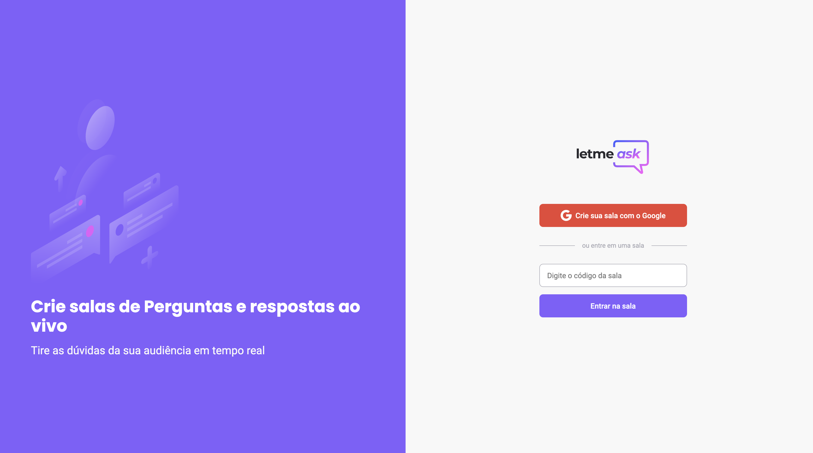

<h1 align="center">
  
</h1>

  <a href="#-tecnologias">Tecnologias</a>&nbsp;&nbsp;&nbsp;|&nbsp;&nbsp;&nbsp;
  <a href="#-projeto">Projeto</a>&nbsp;&nbsp;&nbsp;|&nbsp;&nbsp;&nbsp;
  <a href="#-layout">Lições aprendidas</a>&nbsp;&nbsp;&nbsp;|&nbsp;&nbsp;&nbsp;
  <a href="#-como-executar">Como executar</a>&nbsp;&nbsp;&nbsp;|&nbsp;&nbsp;&nbsp;
  <a href="#-licença">Licença</a>

## ✨ Tecnologias

Esse projeto foi desenvolvido com as seguintes tecnologias:

- [React](https://reactjs.org)
- [Firebase](https://firebase.google.com/)
- [TypeScript](https://www.typescriptlang.org/)

## 💻 Projeto

O letmeask é um app que permite a criação de salas para perguntas ao vivo com a atualização em realtime.
O projeto foi criado durante a Next Level Week Together da Rocketseat na trilha de ReactJS durante os dias 20/06 e 24/06/21. 

## 🔖 Lições aprendidas

O projeto teve bastante foco no uso de hooks personalizadas, componentização e integração com o firebase usando as funcionalidades de realtime database, autenticação com o Google e hospedagem.

## 🚀 Como executar

- Clone o repositório
- Instale as dependências com `yarn`
- Inicie o servidor com `yarn dev`
- Crie um arquivo .env.local e inclua seus valores de integração com o firebase

Agora você pode acessar [`localhost:3000`](http://localhost:3000) do seu navegador.

## 📄 Acesse aqui

Você pode acessar minha versão do web app em produção[aqui](https://letmeask-b3788.web.app/)

---

Feito com ♥ by Simara Conceição [Escute o podcast quero ser dev!](https://open.spotify.com/show/59vCz4TY6tPHXW26qJknh3)
